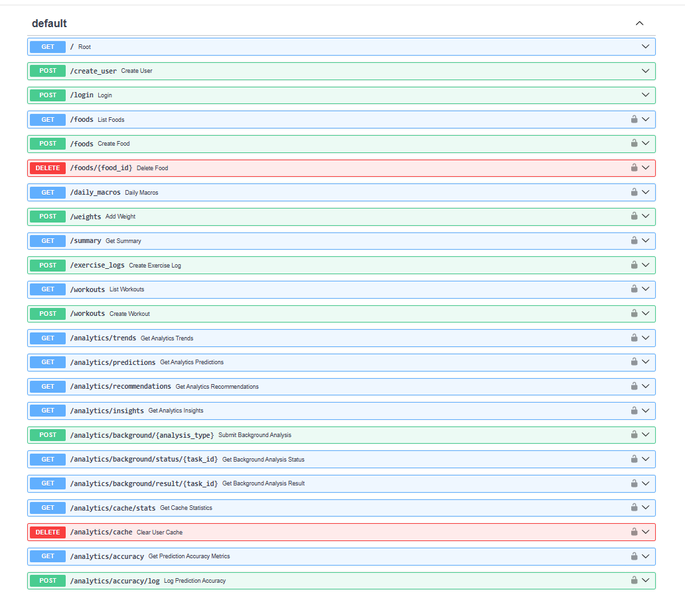
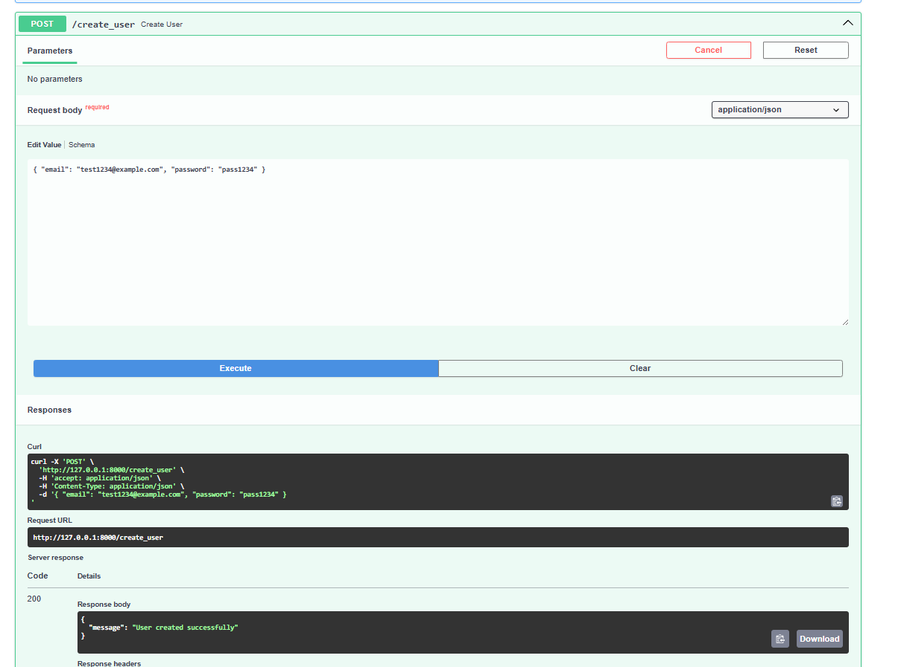
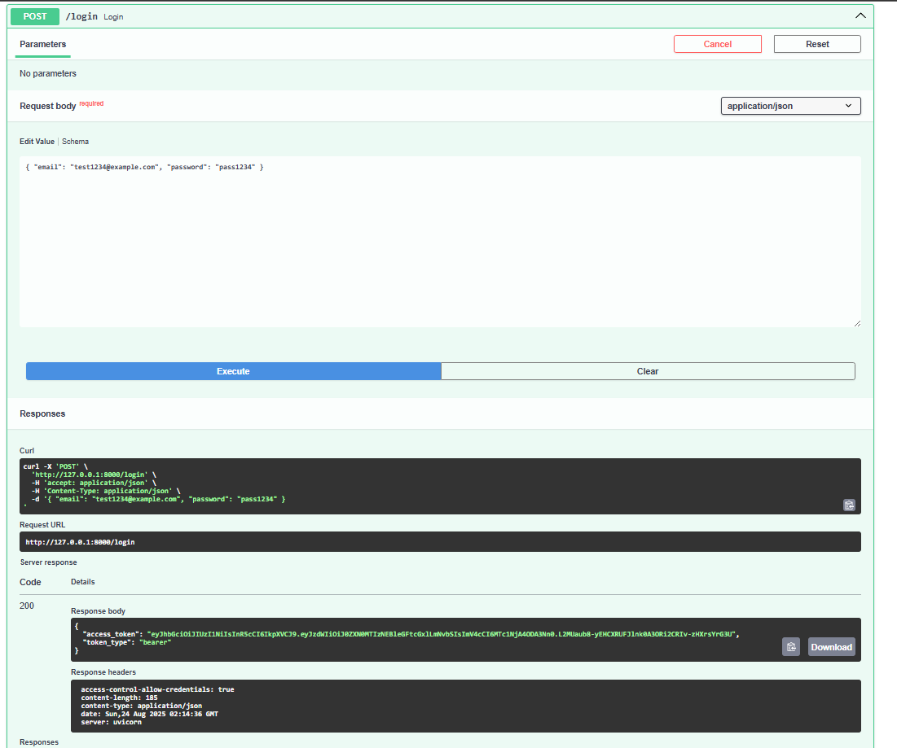
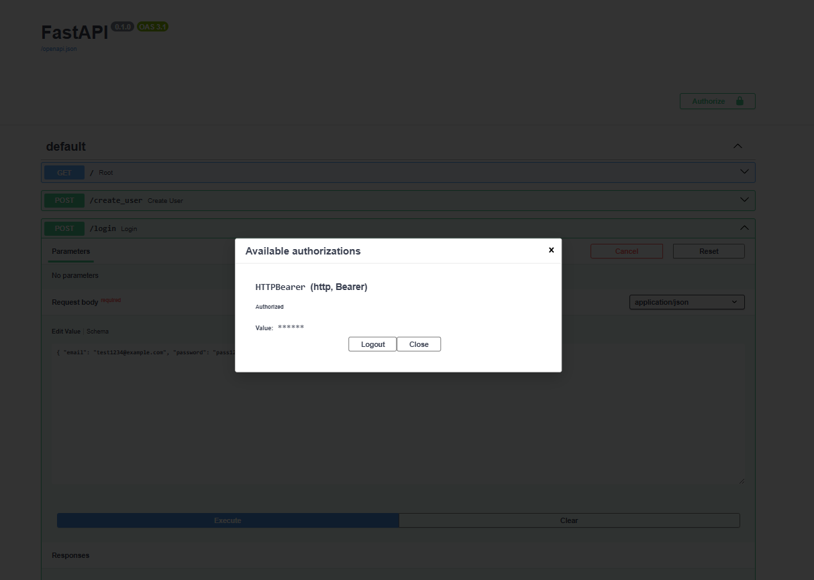
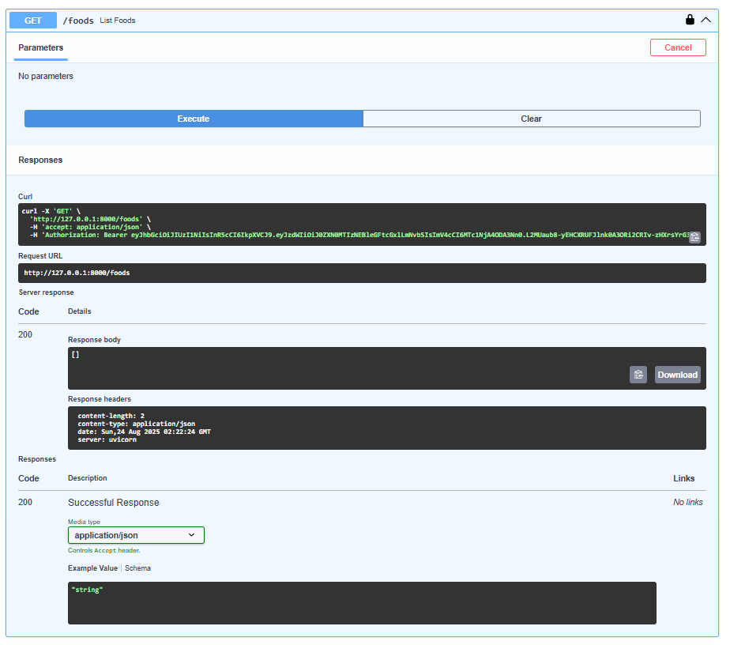
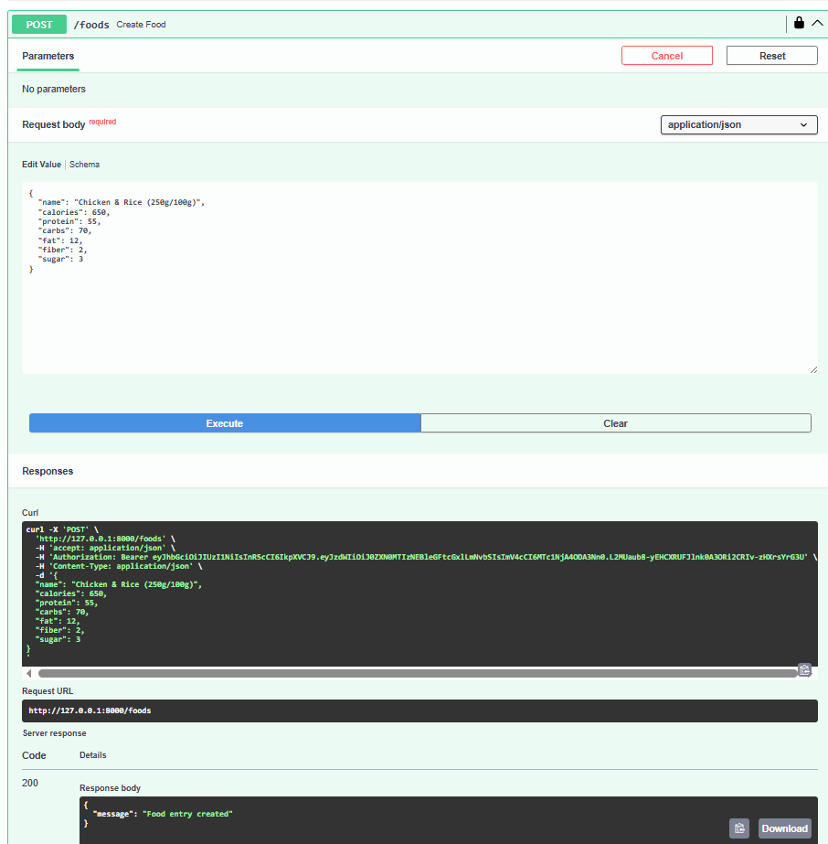
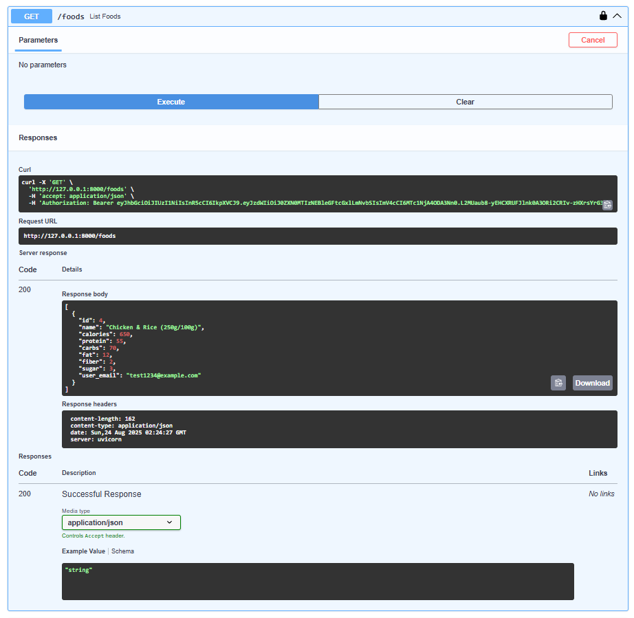
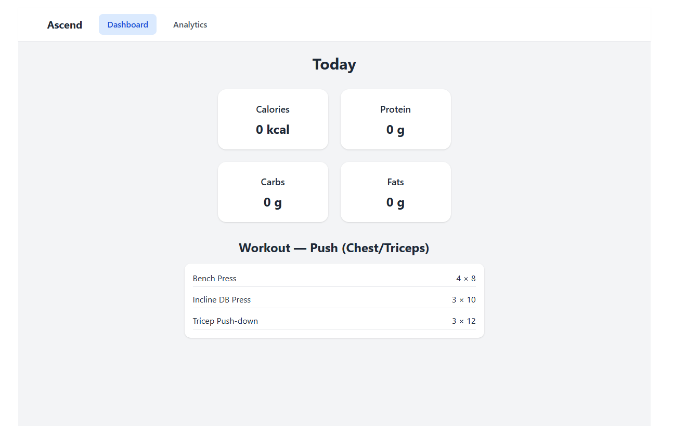

# Ascend — Fitness & Nutrition Tracker

Ascend is a full-stack application to track meals, bodyweight, and training performance.  
It uses a **FastAPI backend** and a **React (Vite + Tailwind) frontend**, with **JWT authentication** and **SQLite storage**.  

---

## 🚀 Tech Stack
- **Backend:** FastAPI, Pydantic, python-jose (JWT), SQLite  
- **Frontend:** React (Vite), Tailwind  
- **Auth:** JWT (via python-jose + bcrypt)  
- **Infrastructure Ready:** Easy to extend to Docker/Postgres/AWS  
- **Tests:** pytest  

---

## ✨ Features
- Secure JWT login/register  
- Food logging (create, list, delete entries)  
- Daily macro summaries  
- Workout & exercise logging  
- Analytics endpoints for trends and performance insights  
- Clean separation: `app/` (API backend) and `ascend-frontend/` (React UI)  

---

## 🛠️ Run Locally

### 1. Backend
```bash
# Create virtual environment
python -m venv .venv && source .venv/bin/activate   # Windows: .venv\Scripts\activate

# Install dependencies
pip install -r requirements.txt

# Create .env file from example
cp .env.example .env   # or copy manually on Windows

# Initialize database
python init_db.py

# Run API
uvicorn app.main:app --reload
```
API available at: http://127.0.0.1:8000

Swagger docs: http://127.0.0.1:8000/docs

### 2. Frontend
```bash

cd ascend-frontend
npm install
npm run dev

```
UI available at: http://127.0.0.1:5173

### 3. Security Notes

No secrets are committed; use .env (already ignored by git).

JWT SECRET_KEY must be set in .env.

CORS origins are configurable via .env.

### 4. Screenshots


**Swagger – Endpoints (auth-protected routes 🔒)**


**Create User**


**Login → JWT token**


**Authorize with token**


**Foods (before) — GET /foods (authorized)**


**Create Food — POST /foods**


**Foods (after) — GET /foods (authorized)**


**Frontend — Dashboard**



